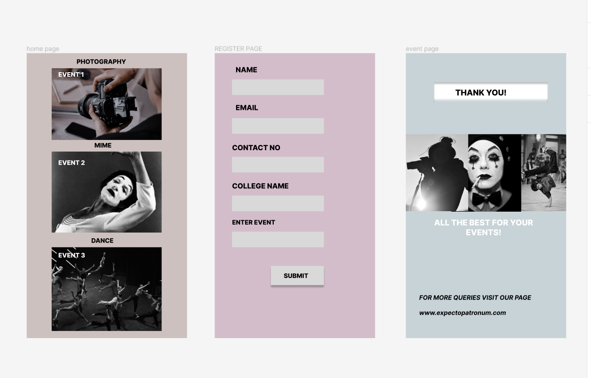

# Event Registration Web Application

## AIM:
To design, develop and deploy a web application for event registration.

## DESIGN STEPS:

### Step 1:
create a new frame

### Step 2:
select any preset you want

### Step 3:
select the shapes you need

### Step 4:
import images

### Step 5:
create pages based on your needs and link them
### Step 6:

Validate the HTML and CSS code.

### Step 7:

Publish the website in the given URL.

## DESIGN:
FIGMA

## PROGRAM :

```
/* Rectangle 1 */
position: absolute;
width: 206px;
height: 35px;
left: 39px;
top: 59px;
background: #D9D9D9;


/* Rectangle 2 */
position: absolute;
width: 206px;
height: 35px;
left: 39px;
top: 146px;
background: #D9D9D9;


/* Rectangle 3 */
position: absolute;
width: 206px;
height: 35px;
left: 39px;
top: 233px;
background: #D9D9D9;


/* Rectangle 4 */
position: absolute;
width: 206px;
height: 35px;
left: 39px;
top: 320px;
background: #D9D9D9;


/* Rectangle 5 */
position: absolute;
width: 206px;
height: 35px;
left: 39px;
top: 401px;
background: #D9D9D9;


/* NAME */
position: absolute;
width: 106px;
height: 15px;
left: 47px;
top: 28px;
font-family: 'Inter';
font-style: normal;
font-weight: 800;
font-size: 16px;
line-height: 19px;
color: #000000;


/* EMAIL */
position: absolute;
width: 106px;
height: 15px;
left: 47px;
top: 113px;
font-family: 'Inter';
font-style: normal;
font-weight: 800;
font-size: 16px;
line-height: 19px;
color: #000000;

/* EMAIL */
position: absolute;
width: 106px;
height: 15px;
left: 47px;
top: 113px;
font-family: 'Inter';
font-style: normal;
font-weight: 800;
font-size: 16px;
line-height: 19px;
color: #000000;

/* CONTACT NO */
position: absolute;
width: 121px;
height: 23px;
left: 39px;
top: 203px;
font-family: 'Inter';
font-style: normal;
font-weight: 800;
font-size: 16px;
line-height: 19px;
color: #000000;


/* COLLEGE NAME */
position: absolute;
width: 133px;
height: 23px;
left: 39px;
top: 289px;
font-family: 'Inter';
font-style: normal;
font-weight: 800;
font-size: 16px;
line-height: 19px;
color: #000000;


/* ENTER EVENT */
position: absolute;
width: 175px;
height: 23px;
left: 39px;
top: 371px;
font-family: 'Inter';
font-style: normal;
font-weight: 800;
font-size: 14px;
line-height: 17px;
color: #000000;

/* Rectangle 6 */
position: absolute;
width: 119px;
height: 43px;
left: 126px;
top: 478px;
background: #D9D9D9;
box-shadow: 0px 5px 4px rgba(0, 0, 0, 0.25);


/* SUBMIT */
position: absolute;
width: 67px;
height: 15px;
left: 155px;
top: 491px;
font-family: 'Inter';
font-style: normal;
font-weight: 800;
font-size: 14px;
line-height: 17px;
color: #000000;

/* event page */


position: relative;
width: 360px;
height: 640px;
background: rgba(180, 198, 203, 0.71);

/* home page */
position: relative;
width: 360px;
height: 640px;
background: #CDC1BF;
```

## OUTPUT:


## Result:

